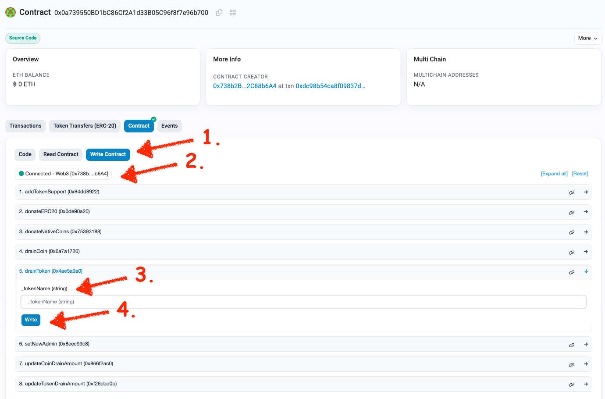

# token-faucet
Testnet ERC20 &amp; Native coins faucet

> Caution!
> 1. Can be used by an account only once per 24 hours!
> 2. The account must have native coins to pay the TX fee!
> 3. Maximum native coin 0.1 per 24 hours
> 4. Maximum native token 100 per 24 hours

## Goerly 

Requires min 0.029 ETH to call the functions.

[Faucet Address](https://goerli.etherscan.io/address/0x51D42f33d7f29E546b5cE6c83679b28f60466b45#writeContract)

### Supported tokens: 

- [USDT](https://goerli.etherscan.io/token/0x291E558C60FB567087D9b87bd62b84Af67b9a376#code) - initial supply: $10M
- [DAI](https://goerli.etherscan.io/token/0x3fcc5C26fAd6B8fC9461E1d6f920A3C96F15f40a#code) - initial supply: $5M
- [BUSD](https://goerli.etherscan.io/address/0x2991E99Df3EDD3F15962294A28b0aD1F4d56E07a#code) - initial supply: $10M

## Using the Faucet

0. Open the faucet contract of the chain of interest, for example, on Goerly
1. Open the `Write Contract` tab
2. Connect your Metamask or other compatible wallet
3. Unfold the `drainToken` fropdown & provide the token name, ex. USDT or DAI or BUSD, etc.
4. Click the `Write` button & confirm the transaction in your wallet.

## Testnet BSC

[Faucet Address](https://testnet.bscscan.com/address/0xdffcff0d6598b0bddcf9df90c98321078cffd4e0#writeContract)

### Supported tokens:

- [EMMET](https://testnet.bscscan.com/token/0x11b8df9c0906a44141f47245f6ea52a5553431c8) - initial supply 1,000,000 EMMET

## Using the Faucet

Same as above.
